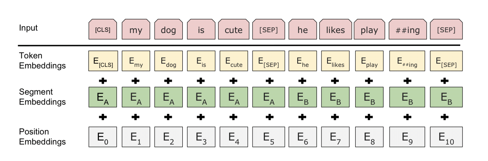
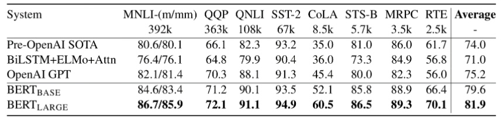
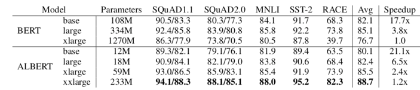
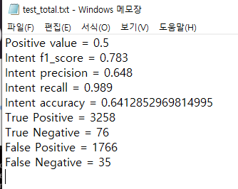
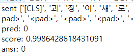
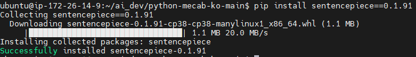
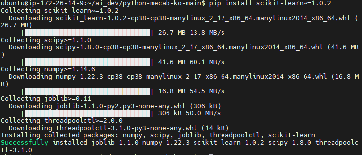
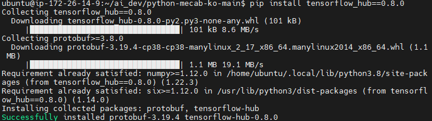
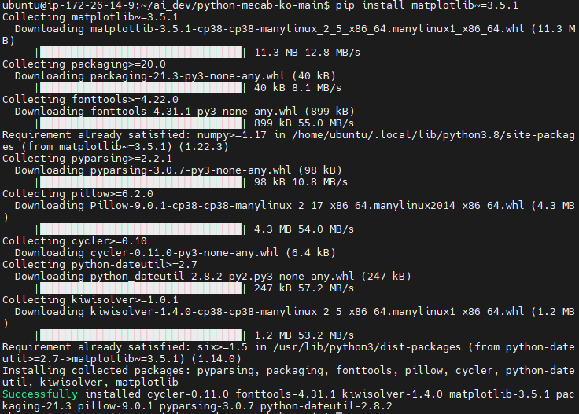

# CU;LETTER


&nbsp;

**See U Later**

> 다시 만날 날을 기대하며 인사한다는 의미를 담아 프로젝트 이름을 CU;LETTER로 정하였습니다.
> 
> CU;LETTER는 사용자가 작성한 편지 내용에 어울리는 편지지와 음악을 추천해주고 상대에게 편지를 전송하는 기능을 제공합니다. 편지를 쓰기 위해서는 정성을 들여 편지의 내용을 작성하는 것 뿐만 아니라 예쁜 편지지를 고르고 우표를 붙이고 이를 우체국에 전달하기 위한 과정 또한 포함됩니다. 마음을 담는 과정을 제외한 나머지 과정을 최소한으로 줄이고 소중한 편지를 반영구적으로 저장하기 위해 디지털 매체를 통한 편지 전달 서비스를 기획했습니다.

------

## 👪 팀원 & 역할

   - 김도현 : 팀장, Back-end
   - 강민수 : Front-end
   - 김경협 : Back-end
   - 김은송 : Front-end
   - 김정연 : Front-end
   - 정유환 : Back-end

## 🔨 기술 스택

- **이슈 관리**
  - Jira
- **형상 관리**
  - Gitlab
- **와이어 프레임**
  - Figma
- **ERD**
  - MySQL
- **커뮤니케이션**
  - Mattermost
  - Notion
  - Google 스프레드시트
  - Google 프레젠테이션
- **IDE**
  - Visual Studio Code
  - IntelliJ IDEA Community
- **Front-end**
  - React
  - React Hooks
  - Next.js
  - Material-UI
- **Back-end**
  - Spring Boot
  - Spring Security
  - Spring Data JPA
  - QueryDSL
- **AI**
  - PyTorch
- **Database**
  - MySQL
- **Server**
  - AWS EC2
- **DevOps**
  - Jenkins
  - Docker

## 📒 프로젝트 기획

### [Notion](https://caramel-garden-eaf.notion.site/PJT-9f880c9b1c8f49b4816896ceecc1dfbf)


### [기능명세서](https://docs.google.com/spreadsheets/d/1M-Tj_9stk1RYr7TkYBQLlRbTxCMwEtcMLWN7hLk0FFw/edit#gid=0)


### [와이어 프레임](https://www.figma.com/file/d6ihfp4yZV1Oy2B0XqMMcW/%ED%8A%B9%ED%99%94%ED%94%84%EB%A1%9C%EC%A0%9D%ED%8A%B8%3A-A201?node-id=0%3A1)


### [ERD](README.assets/ERD.PNG)


### [API 명세서](https://docs.google.com/spreadsheets/d/1PFSrwoFqF-2cbXGW0iAQ9UX8ulqPsUkS6NJEa9XhySA/edit#gid=0)


### [개발 환경 세팅](https://caramel-garden-eaf.notion.site/Infra-a1cb96c6ec0540e788e3d93bf8c9cc3d)


## 🎞 프로젝트 진행상황

### Front-end

#### 로그인


#### 회원가입
>이메일, 비밀번호, 이름 입력하여 회원가입


#### 랜딩 페이지
>로그인 성공 시 랜딩 페이지로 전환


#### 메인페이지
>편지쓰기, 받은편지, 보낸편지, 작성중인 편지 확인 


#### 수신인 선택 가능
>큐레터 친구 또는 비회원 중 선택가능  


#### 편지 형식 선택
>포토카드, 편지, 엽서 중 형식 선택


#### 편지 쓰기
>편지의 제목과 내용을 입력  


#### 노래 추천
>편지의 내용과 어울리는 노래 추천


#### 받은 편지함
>받은 편지 확인 


#### 보낸 편지함
>보낸 편지 확인


#### 친구목록
>친구로 등록해놓은 사용자, 친구 요청, 즐겨찾기로 등록한 친구를 확인


# 감정 분석 모델 정리

문장을 분석한 뒤 6가지 감정 중 하나로 분류하는 모델을 검색하고, 해당 모델에 대해 학습 및 테스트하고 서버에 올리는 과정을 정리했다.

# AI 모델 분석

---

### 사용한 모델: ALBERT

ALBERT는 BERT 모델의 경량화 된 버전으로 이를 이해하려면 BERT 모델을 먼저 이해해야 한다.

## BERT 이해하기

---

BERT는 Bidrectional Encoder Representations from Transformers의 약자로 Transformer 기반의 자연어 처리를 위한 NLP 모델이다. BERT는 위 사진의 모델 아키텍쳐 중 인코더만 사용하는 모델이다.

### BERT의 학습 과정

unlabeled data로 모델을 미리 학습 시킨 후, 특정 task를 가지고 있는 labeled data로 **transfer learning**을 한다.

**BERT의 pre-trained 과정**

- Masked Language Model(MLM): Input 전체 + mask 처리된 token을 한 번에 Transformer encoder에 넣고, origin token 값을 예측함
- next sentence prediction: 두 문장을 pre-training 시에 같이 넣어줘서 두 문장이 이어지는 문장인지 추측함

**Model Arcitecture**

- Transformer 중에서 Encoder 부분만 사용



- 위 그림과 같이 BERT는 3가지 embedding 값의 합으로 이루어져 있음
- WordPiece Embedding과, Position Embedding을 사용햇다. wordpiece embedding은 세상의 모든 단어들을 다 학습할 수는 없기 때문에 사용할 단어를 한정 짓는 방법이다.
    - Wordpiece Embedding 참고:
    
    [Word Piece Model (a.k.a sentencepiece)](https://lovit.github.io/nlp/2018/04/02/wpm/)
    
- 모든 Sentence의 첫 번째 Token은 [CLS] (special classification token)을 가지게 된다. 이 토큰은 학습 후, token sequence의 결합된 의미를 가지게 된다. 따라서 classifier를 붙이면 단일 문장 혹은 연속된 문장의 classification을 하는데 도움이 된다.

BERT 모델의 성능 비교



## ALBERT 이해하기

---

ALBERT 모델에서는 BERT와 동일하지만 BERT에 없는 3가지 주요 요소가 추가되었다.

- Factorized embedding parameterization: Input Layter의 Parmeter 수를 줄여서 모델의 크기를 줄였다.
- Cross-layer parameter sharing: Transformer의 각 Layer 간 같은 Parameter를 공유하게 하여 사용했다. → 결과적으로 모델의 크기가 줄어든다.
- Sentence order prediction: BERT에서 사용한 Next Sentence Prediction 방법 대신에 두 문장 간 순서를 맞추는 방식으로 학습하였다. → NSP 방식보다 성능 향상



성능 결과표를 봤을 때 BERT 모델보다 Parmeter 개수는 줄이면서 성능은 더 높인걸 확인할 수 있다.

# 환경 설정

---

### 사용할 데이터셋

- 감성 대화 말뭉치 소개:

[감성 대화 말뭉치](https://aihub.or.kr/aidata/7978)

- 데이터셋 설명:

[](https://aihub.or.kr/sites/default/files/2021-06/06.%20%5B%EC%9E%90%EC%97%B0%EC%96%B4%EC%98%81%EC%97%AD%5D%20%EA%B0%90%EC%84%B1%20%EB%8C%80%ED%99%94%20%EB%A7%90%EB%AD%89%EC%B9%98.pdf)

- 모델 설명:  22p 참고

[](https://aihub.or.kr/sites/default/files/Sample_data/%EA%B5%AC%EC%B6%95%ED%99%9C%EC%9A%A9%EA%B0%80%EC%9D%B4%EB%93%9C%EB%B6%81_2020-01/018.%EA%B0%90%EC%84%B1%EB%8C%80%ED%99%94_%EB%8D%B0%EC%9D%B4%ED%84%B0_%EA%B5%AC%EC%B6%95_%EA%B0%80%EC%9D%B4%EB%93%9C%EB%9D%BC%EC%9D%B8.pdf)

AIhub에서 사용한 ALBERT 모델을 커스터마이징하여 그대로 사용하기로 했다. 

AIhub의 인공지능 모델에서는 발화체를 Input으로한 텍스트를 받아 기쁨, 슬픔, 당황, 분노, 상처, 불안 6가지 감정으로 분류하고 있다.

### Trained 모델 사용 시 결과값 예시



학습된 모델의 실행 결과 값이다. intent precision 기준으로 0.5 이상이면 올바르게 감정 분류가 수행됐다는 의미로 간주해 감정 분류 파일을 따로 저장한다. 위 예시에서는 0.648로 다음과 같은 파일이 생성된다.



여기서 pred 항목을 통해 어떤 항목으로 분류가 되었는지 확인할 수 있다.

### 설치 환경

- ubuntu 20.04 LTS
- python 3.8.2-0ubuntu2
- pip 20.0.2

### 모델 사용 전 설치해야할 프로그램

- **Mecab 형태소 분석기**
    - require: wget, python3-dev
    
    ```bash
    # python3-dev
    sudo apt install python3-dev
    # wget 이미 설치 되어 있음
    ```
    
    python-mecab-ko 1.0.12: 
    
    [https://github.com/jonghwanhyeon/python-mecab-ko](https://github.com/jonghwanhyeon/python-mecab-ko)
    
    위에서 zip 파일 받은 후, ec2에 올려놓고 그 폴더에 들어가서 다음 커맨드 실행
    ```
    python3 setup.py install
    ```
    
        

- **BPE Tokenizer: 구글의 SentencePiece**



- **scikit-learn**



- **tensorflow_hub**



- **matplotlib**



- **numpy(이미 설치되어 있음)**

- **six**

testresources 패키지 먼저 설치 후 six 패키지 설치

```bash
sudo apt install python3-testresources
pip install six~=1.16.0
```

## TensorFlow Issue

사용할 오픈 소스의 모델이 requirement를 명확하게 명시하지 않아서 실험적으로 프로그램을 설치해 나가며 Tensorflow 모델을 알아냈다.

- 만들어져 있는 모델이 TF2.x 버전이 아니라 1.x 버전이다.

다음은 1.x의 마지막 버전인 1.15 버전을 설치하고, 이에 맞는 다른 플러그인들도 버전을 맞춰주는 작업이다.

- **Server Python 3.x으로 변경 & Downgrade**
    
    ```bash
    # 원하는 버전 설치
    sudo apt-get install python3.7
    
    # 아래 링크에서 버전 변경하기,
    ```
    
    [우분투에서 파이썬 버전 변경하기](https://seongkyun.github.io/others/2019/05/09/ubuntu_python/)
    
- **TensorFlow 1.15 버전 설치**
    
    ```bash
    pip install tensorflow==1.15
    ```
    
- **Keras 2.3.1 버전 설치**
    
    ```bash
    pip install keras==2.3.1
    ```
    
- **1.15 버전에 맞는 tensorflow_hub 설치**
    
    ```bash
    $ pip install "tensorflow>=1.15,<2.0"
    $ pip install --upgrade tensorflow-hub
    ```
    

근데 설치하다 보니깐 scikit-learn 버전이 안 맞는게 python 3.7버전일 수도 있겠다...

# 모델 사용

---

### 모델 실행

```bash
# Training 되어 있는 model로 결과 뽑기
python3 eval_joint_bert_allsents.py -d=data/test -m=save_model/epoch30
```

## 이 후 진행 사항

- 테스트 후 성능 개선 필요 시, 모델 데이터 추가 및 재학습
- 모델 Input값, Output값 커스터마이징
- Flask 혹은 Django로 서버에 올리기


