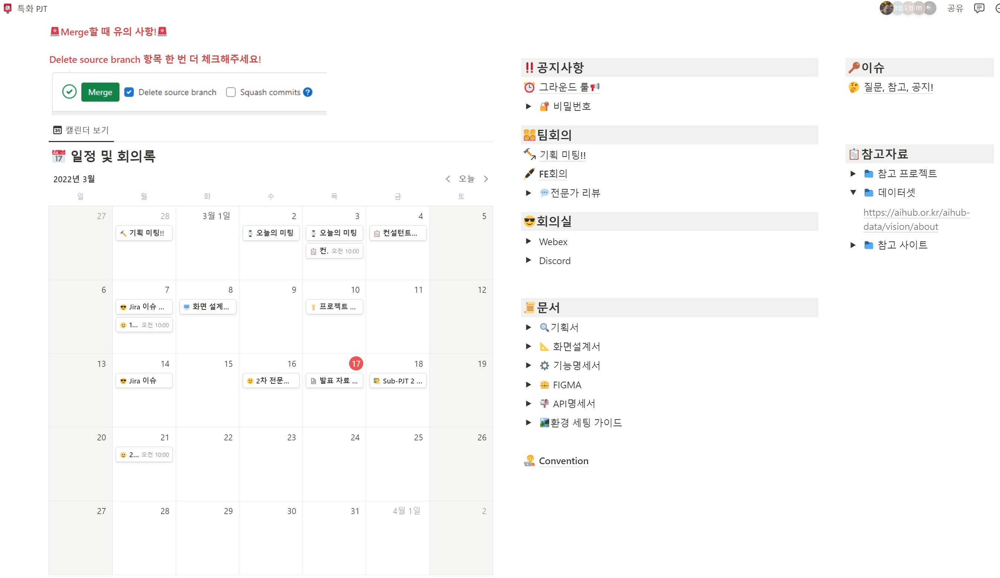
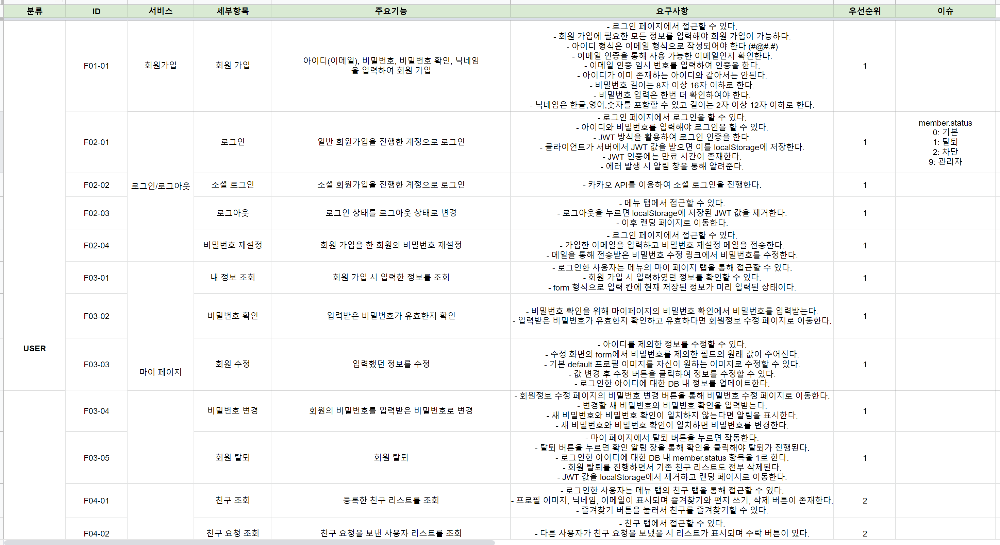
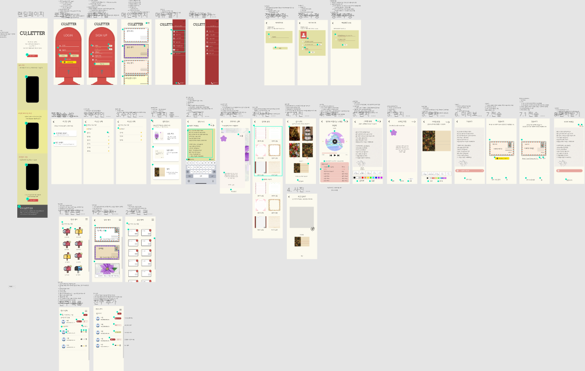
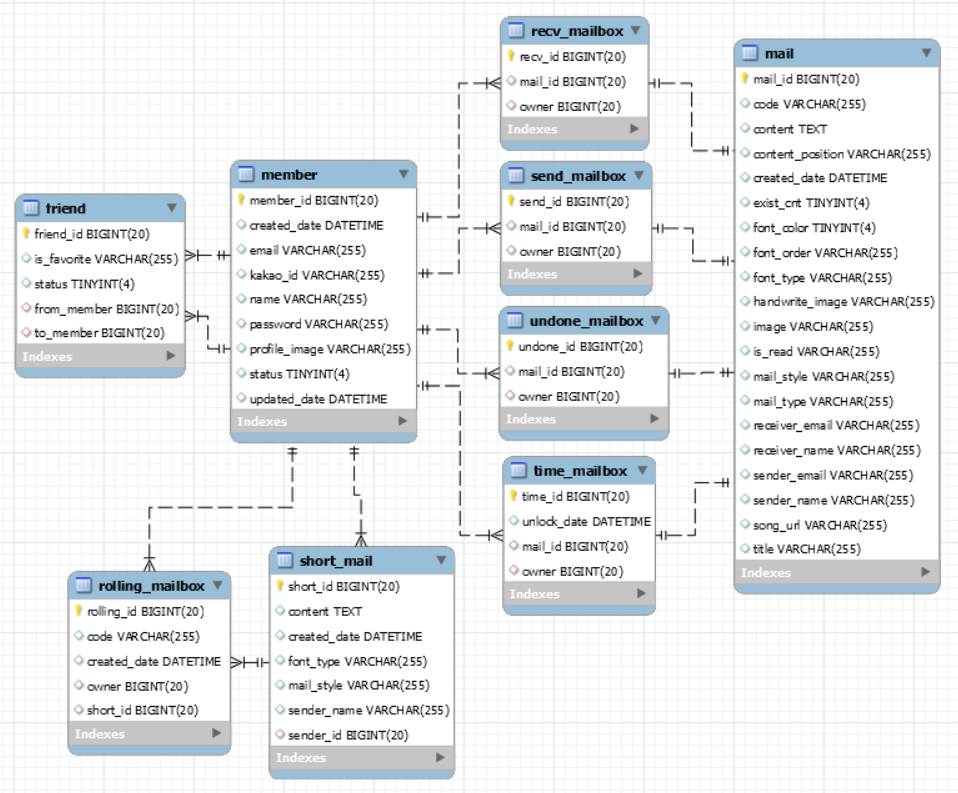
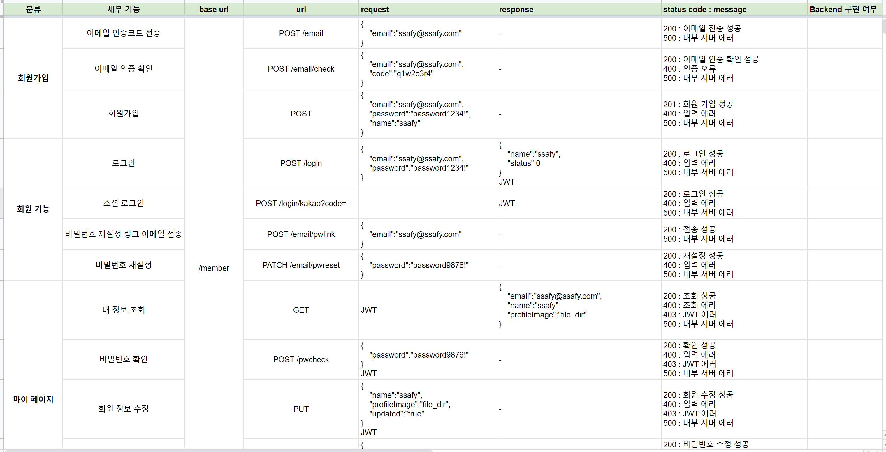
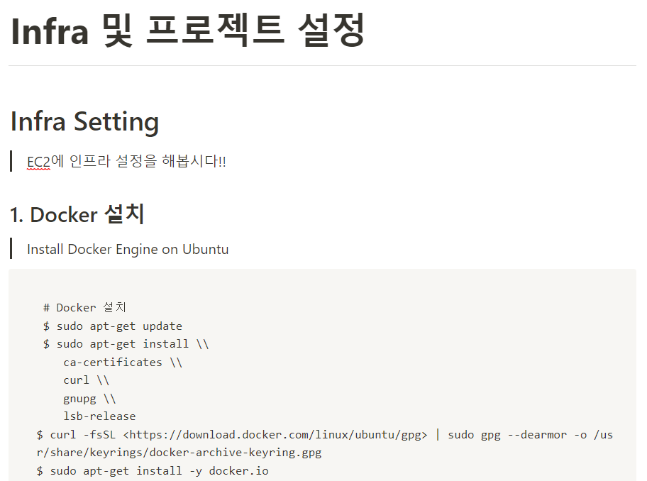

# CU;LETTER

&nbsp;

**See U Later**

> 다시 만날 날을 기대하며 인사한다는 의미를 담아 프로젝트 이름을 CU;LETTER로 정하였습니다.
> 
> CU;LETTER는 사용자가 작성한 편지 내용에 어울리는 편지지와 음악을 추천해주고 상대에게 편지를 전송하는 기능을 제공합니다. 편지를 쓰기 위해서는 정성을 들여 편지의 내용을 작성하는 것 뿐만 아니라 예쁜 편지지를 고르고 우표를 붙이고 이를 우체국에 전달하기 위한 과정 또한 포함됩니다. 마음을 담는 과정을 제외한 나머지 과정을 최소한으로 줄이고 소중한 편지를 반영구적으로 저장하기 위해 디지털 매체를 통한 편지 전달 서비스를 기획했습니다.

------

## 👪 팀원 & 역할

   - 김도현 : 팀장, Back-end
   - 강민수 : Front-end
   - 김경협 : Back-end
   - 김은송 : Front-end
   - 김정연 : Front-end
   - 정유환 : Back-end

## 🔨 기술 스택

- **이슈 관리**
  - Jira
- **형상 관리**
  - Gitlab
- **와이어 프레임**
  - Figma
- **ERD**
  - MySQL
- **커뮤니케이션**
  - Mattermost
  - Notion
  - Google 스프레드시트
  - Google 프레젠테이션
- **IDE**
  - Visual Studio Code
  - IntelliJ IDEA Community
- **Front-end**
  - React
  - React Hook
  - Next.js
  - Material-UI
- **Back-end**
  - Spring Boot
  - Spring Security
  - Spring Data JPA
  - QueryDSL
- **Database**
  - MySQL
- **Server**
  - AWS EC2
- **DevOps**
  - Docker
  - Jenkins

## 📒 프로젝트 기획

### [Notion](https://caramel-garden-eaf.notion.site/PJT-9f880c9b1c8f49b4816896ceecc1dfbf)

### [기능명세서](https://docs.google.com/spreadsheets/d/1M-Tj_9stk1RYr7TkYBQLlRbTxCMwEtcMLWN7hLk0FFw/edit#gid=0)

### [와이어 프레임](https://www.figma.com/file/d6ihfp4yZV1Oy2B0XqMMcW/%ED%8A%B9%ED%99%94%ED%94%84%EB%A1%9C%EC%A0%9D%ED%8A%B8%3A-A201?node-id=0%3A1)

### [ERD](README.assets/ERD.PNG)

### [API 명세서](https://docs.google.com/spreadsheets/d/1PFSrwoFqF-2cbXGW0iAQ9UX8ulqPsUkS6NJEa9XhySA/edit#gid=0)

### [개발 환경 세팅](https://www.notion.so/Back-end-Init-a1cb96c6ec0540e788e3d93bf8c9cc3d)

